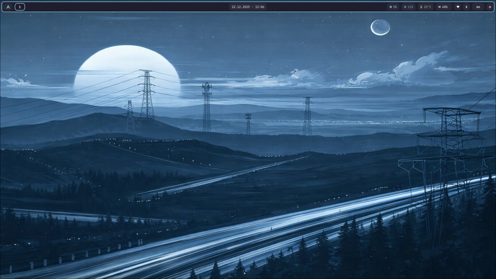
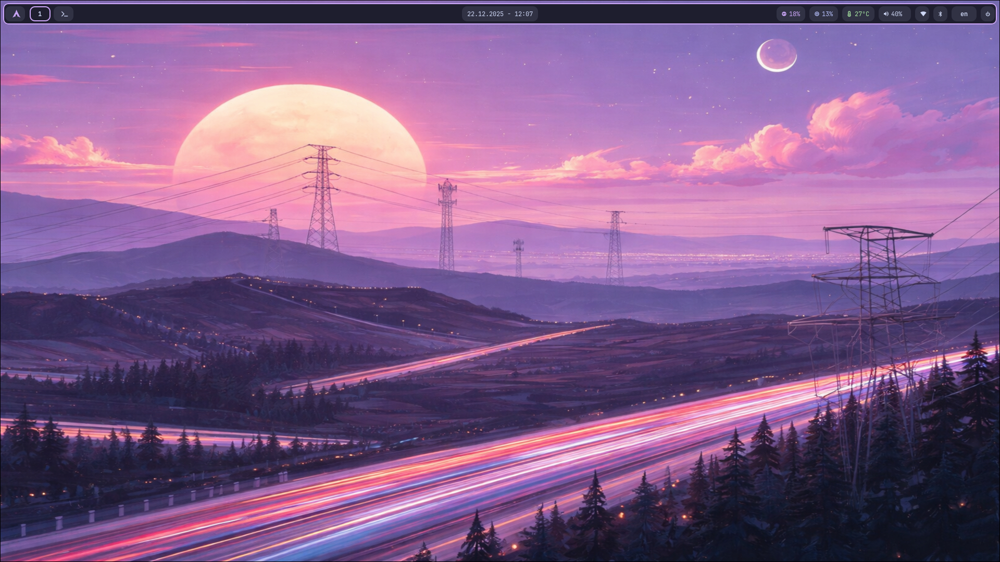
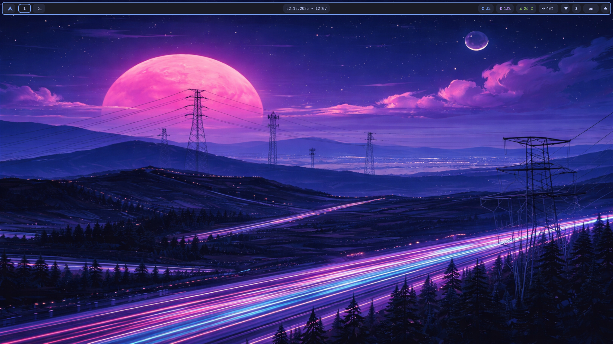
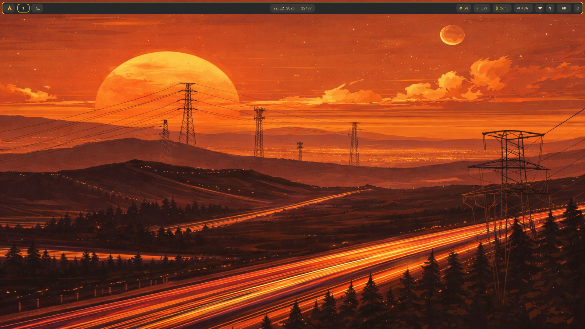
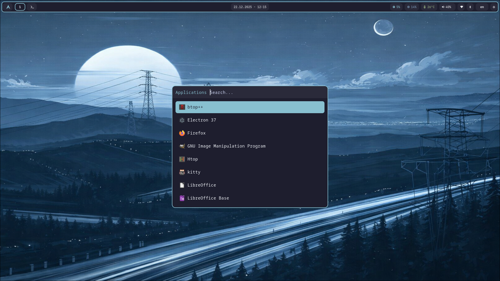
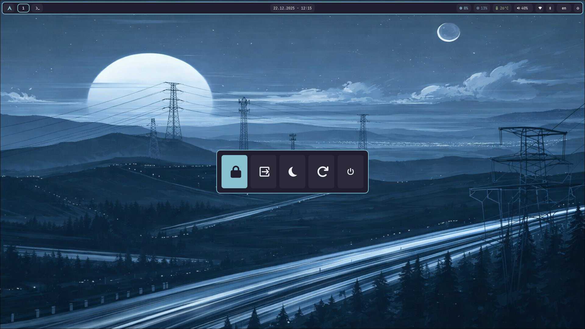

# 🎨 Hyprland Dotfiles

[English](README.md) | [Русский](README.ru.md)

Моя конфигурация Hyprland для Arch Linux с динамическими темами, кастомными скриптами и расширенной кастомизацией.


---

## 📸 Скриншоты









---

## 🖥️ Информация о системе

- **ОС**: Arch Linux
- **WM**: Hyprland 0.52.2
- **Терминал**: Kitty
- **Панель**: Waybar
- **Уведомления**: SwayNC
- **Лаунчер**: Rofi
- **Файловый менеджер**: Thunar
- **Блокировка экрана**: Hyprlock
- **Менеджер входа**: SDDM (с кастомной темой)

---

## ✨ Возможности

### 🎨 Динамическая смена тем
- **4 цветовые схемы**: Nord, Catppuccin Mocha, Tokyo Night, Gruvbox
- **Единая смена темы**: Изменяет все компоненты одновременно
  - Цвета и рамки Hyprland
  - Стиль Waybar
  - Меню Rofi (launcher, powermenu, clipboard, calendar, window switcher)
  - Уведомления SwayNC
  - Экран блокировки Hyprlock
  - Экран входа SDDM
- **Горячие клавиши**: `SUPER + T` (меню), `SUPER + SHIFT + T` (переключение)

### 🪟 Управление окнами
- **Динамические индикаторы воркспейсов**: Показывает иконки запущенных приложений
- **Переключение окон**: `SUPER + Tab` с тематизированным интерфейсом Rofi
- **Умные правила окон**: Автоматическое размещение для конкретных приложений
- **Размытие и прозрачность**: Неактивные окна с лёгкой прозрачностью (92%)

### 🔔 Уведомления и статус-бар
- **Кастомные модули Waybar**:
  - Использование CPU и памяти (клик открывает btop)
  - Мониторинг температуры с критическими оповещениями
  - Сеть (WiFi/Ethernet) с уровнем сигнала
  - Индикатор раскладки клавиатуры (EN/RU с цветной подсветкой)
  - Статус батареи с цветовой индикацией заряда:
    - 🔴 Красный (0-20%): Критический
    - 🟡 Жёлтый (21-70%): Предупреждение
    - 🟢 Зелёный (71-100%): Нормальный
  - Статус Bluetooth
  - Управление громкостью и яркостью
- **Центр уведомлений SwayNC**: `SUPER + N`
- **Виджет календаря**: Клик на часах открывает интерактивный календарь (русская локаль)

### 🎵 Мультимедиа управление
- **OSD громкости**: Визуальные уведомления с прогресс-барами
- **OSD яркости**: Показывает изменение уровня яркости
- **Управление медиа**: Отображает текущий трек, исполнителя и альбом
- **Поддержка Fn клавиш**: Интеграция нативных мультимедиа клавиш

### 🖼️ Управление обоями
- **Динамическая смена обоев** с SWWW
- **Сохранение обоев**: Восстанавливает последние обои при входе
- **Интеграция с SDDM**: Экран входа использует текущие обои
- **Горячие клавиши**:
  - `SUPER + W`: Следующие обои
  - `SUPER + SHIFT + W`: Предыдущие обои
  - `SUPER + CTRL + W`: Случайные обои

### ⌨️ Раскладка клавиатуры
- **Поддержка двух раскладок**: Английская/Русская с переключением `Alt + Shift`
- **Визуальный индикатор**: Показывает текущую раскладку (EN/RU) в Waybar
- **Цветная подсветка**: Красный для Русской, Синий для Английской

### 📋 Буфер обмена и скриншоты
- **История буфера обмена**: `SUPER + V` с тематизированным интерфейсом Rofi
- **Инструменты скриншотов**:
  - `Print`: Полный скриншот с уведомлением
  - `Shift + Print`: Выделение области
  - `Ctrl + Print`: Активное окно
- **Авто-сохранение**: Скриншоты сохраняются в `~/Pictures/Screenshots/`

### 🔒 Безопасность и аутентификация
- **Hyprlock**: Тематизированная блокировка экрана с размытием
- **Интеграция Polkit**: GUI аутентификация для системных задач
- **Hypridle**: Автоматическая блокировка и управление питанием
  - Затемнение экрана: 4 минуты
  - Выключение экрана: 5 минут
  - Авто-блокировка: 5 минут
  - Умный suspend: Только от батареи (опционально)

---

## 📦 Компоненты и зависимости

### Ядро
- `hyprland` - Wayland композитор
- `hyprlock` - Блокировка экрана
- `hypridle` - Управление простоем
- `xdg-desktop-portal-hyprland` - Реализация портала

### UI и панель
- `waybar` - Статус-бар
- `swaync` - Демон уведомлений
- `rofi` - Лаунчер приложений и меню

### Управление файлами
- `thunar` - Файловый менеджер
- `thunar-volman` - Управление съёмными носителями
- `gvfs` - Поддержка виртуальной файловой системы

### Утилиты
- `kitty` - Эмулятор терминала
- `wl-clipboard` - Утилиты буфера обмена
- `cliphist` - История буфера обмена
- `grim` - Инструмент скриншотов
- `slurp` - Выделение области экрана
- `swww` - Демон обоев
- `playerctl` - Управление медиа-плеером
- `brightnessctl` - Управление яркостью
- `socat` - Socket утилиты (для модулей Waybar)

### Система
- `polkit-gnome` - Агент аутентификации
- `networkmanager` - Управление сетью
- `nm-connection-editor` - GUI сети
- `bluez` + `bluez-utils` + `blueman` - Поддержка Bluetooth
- `pipewire` + `pipewire-pulse` + `wireplumber` - Аудио
- `pavucontrol` - GUI управления громкостью

### Шрифты
- `ttf-jetbrains-mono-nerd` - Основной UI шрифт с иконками
- `ttf-font-awesome` - Шрифт иконок
- `noto-fonts` + `noto-fonts-emoji` - Поддержка Unicode

### Темы
- `gnome-themes-extra` - Тема Adwaita-dark
- `adwaita-icon-theme` - Тема иконок GTK

---

## 🚀 Установка

### Требования
- Arch Linux
- AUR helper (yay/paru) для дополнительных пакетов (опционально)

### Быстрая установка

```bash
# Клонирование репозитория
git clone https://github.com/alnrog/hypr_dotfiles.git ~/dotfiles
cd ~/dotfiles

# Установка пакетов
chmod +x install.sh
./install.sh

# Создание симлинков
chmod +x symlink.sh
./symlink.sh

# Настройка интеграции SDDM (опционально)
chmod +x setup-sddm-links.sh
./setup-sddm-links.sh

# Выход и вход в Hyprland
```

### Ручная установка

```bash
# Клонирование репозитория
git clone https://github.com/alnrog/hypr_dotfiles.git ~/dotfiles

# Установка пакетов вручную
sudo pacman -S hyprland hyprlock hypridle waybar swaync rofi kitty \
  thunar grim slurp wl-clipboard cliphist swww playerctl \
  brightnessctl polkit-gnome networkmanager blueman \
  pipewire pipewire-pulse pavucontrol \
  ttf-jetbrains-mono-nerd ttf-font-awesome noto-fonts

# Создание симлинков вручную
ln -sf ~/dotfiles/.config/hypr ~/.config/hypr
ln -sf ~/dotfiles/.config/waybar ~/.config/waybar
ln -sf ~/dotfiles/.config/rofi ~/.config/rofi
ln -sf ~/dotfiles/.config/swaync ~/.config/swaync
ln -sf ~/dotfiles/.config/kitty ~/.config/kitty
ln -sf ~/dotfiles/.config/gtk-3.0 ~/.config/gtk-3.0
ln -sf ~/dotfiles/.config/gtk-4.0 ~/.config/gtk-4.0
ln -sf ~/dotfiles/.config/networkmanager-dmenu ~/.config/networkmanager-dmenu
```

---

## ⌨️ Горячие клавиши

### Система
| Клавиши | Действие |
|---------|----------|
| `SUPER + Return` | Открыть терминал |
| `SUPER + D` | Лаунчер приложений |
| `SUPER + E` | Файловый менеджер |
| `SUPER + Q` | Закрыть окно |
| `SUPER + SHIFT + Q` | Выйти из Hyprland |
| `SUPER + SHIFT + L` | Заблокировать экран |
| `SUPER + Escape` | Меню выключения |

### Управление окнами
| Клавиши | Действие |
|---------|----------|
| `SUPER + Стрелки` | Переместить фокус |
| `SUPER + SHIFT + Стрелки` | Переместить окно |
| `SUPER + CTRL + Стрелки` | Изменить размер окна |
| `SUPER + F` | Полноэкранный режим |
| `SUPER + Space` | Переключить плавающий режим |
| `SUPER + C` | Центрировать окно |
| `SUPER + Tab` | Переключатель окон |

### Воркспейсы
| Клавиши | Действие |
|---------|----------|
| `SUPER + 1-9` | Переключить воркспейс |
| `SUPER + SHIFT + 1-9` | Переместить окно на воркспейс |
| `SUPER + ALT + 1-9` | Переместить окно тихо |
| `SUPER + Колёсико мыши` | Переключать воркспейсы |

### Мультимедиа (Fn клавиши)
| Клавиши | Действие |
|---------|----------|
| `Fn + F1/F2` | Яркость вниз/вверх |
| `Fn + F7/F8/F9` | Предыдущий/Play-Pause/Следующий |
| `Fn + F10` | Mute |
| `Fn + F11/F12` | Громкость вниз/вверх |

### Утилиты
| Клавиши | Действие |
|---------|----------|
| `Print` | Скриншот |
| `Shift + Print` | Скриншот области |
| `Ctrl + Print` | Скриншот окна |
| `SUPER + V` | История буфера обмена |
| `SUPER + N` | Центр уведомлений |
| `SUPER + T` | Выбор темы |
| `SUPER + W` | Следующие обои |
| `Alt + Shift` | Переключить раскладку |

---

## 🎨 Темы

### Доступные темы
1. **Nord** - Холодные синие и серые тона
2. **Catppuccin Mocha** - Тёплые пастельные цвета
3. **Tokyo Night** - Тёмная с яркими акцентами
4. **Gruvbox Dark** - Ретро тёплые цвета

### Компоненты темы
Каждая тема включает:
- Цвета Hyprland (`theme-*.conf`)
- Стиль Waybar (`waybar-*.css`)
- Меню Rofi (`launcher-*.rasi`, `powermenu-*.rasi`, и т.д.)
- Уведомления SwayNC (`swaync-*.css`)
- Экран Hyprlock (`hyprlock-*.conf`)

### Переключение тем
```bash
# Интерактивное меню
SUPER + T

# Переключение тем по кругу
SUPER + SHIFT + T

# Командная строка
~/.config/hypr/scripts/theme-switcher.sh set nord
```

---

## 📁 Структура проекта

```
dotfiles/
├── .config/
│   ├── hypr/              # Конфигурация Hyprland
│   │   ├── hyprland.conf  # Основной конфиг (подключает все остальные)
│   │   ├── animations.conf
│   │   ├── autostart.conf
│   │   ├── binds.conf     # Все горячие клавиши
│   │   ├── decoration.conf
│   │   ├── env.conf       # Переменные окружения
│   │   ├── general.conf   # Настройки раскладки
│   │   ├── input.conf     # Конфигурация клавиатуры/мыши
│   │   ├── monitors.conf  # Конфигурация дисплеев
│   │   ├── rules.conf     # Правила окон
│   │   ├── hypridle.conf  # Управление простоем
│   │   ├── scripts/       # Вспомогательные скрипты
│   │   │   ├── theme-switcher.sh
│   │   │   ├── wallpaper.sh
│   │   │   ├── volume-osd.sh
│   │   │   ├── brightness-osd.sh
│   │   │   ├── media-control.sh
│   │   │   ├── rofi-*.sh
│   │   │   └── ...
│   │   └── themes/        # Файлы тем
│   │       ├── theme-*.conf
│   │       ├── waybar-*.css
│   │       ├── swaync-*.css
│   │       └── hyprlock-*.conf
│   ├── waybar/            # Статус-бар
│   │   ├── config         # Конфигурация Waybar
│   │   └── scripts/
│   │       ├── keyboard-layout.sh
│   │       └── workspaces-icons.sh
│   ├── rofi/              # Лаунчер приложений
│   │   └── themes/        # Файлы тем Rofi
│   ├── swaync/            # Уведомления
│   ├── kitty/             # Терминал
│   ├── gtk-3.0/           # Настройки темы GTK3
│   ├── gtk-4.0/           # Настройки темы GTK4
│   └── networkmanager-dmenu/
├── install.sh             # Установка пакетов
├── symlink.sh             # Создание симлинков
├── setup-sddm-links.sh    # Интеграция SDDM
├── LICENSE
└── README.md
```

---

## 🔧 Кастомизация

### Мониторы
Отредактируйте `.config/hypr/monitors.conf` для настройки дисплеев.

### Раскладка клавиатуры
Отредактируйте `.config/hypr/input.conf` для изменения или добавления раскладок.

### Автозапуск приложений
Добавьте в `.config/hypr/autostart.conf`:
```bash
exec-once = your-app
```

### Правила окон
Добавьте в `.config/hypr/rules.conf`:
```bash
windowrule = float, class:^(app-name)$
```

### Обои
Поместите обои в `~/Pictures/Wallpapers/`

---

## 🐛 Решение проблем

### SDDM не показывает обои
```bash
# Повторно запустите настройку SDDM
~/dotfiles/setup-sddm-links.sh

# Исправьте права доступа
chmod 755 ~/.local/share/sddm
chmod 644 ~/.local/share/sddm/wallpaper.jpg
```

### Waybar не запускается
```bash
# Проверьте логи
journalctl --user -u waybar

# Перезапустите вручную
pkill waybar && waybar &
```

### Тема не применяется
```bash
# Перезагрузите Hyprland
hyprctl reload

# Повторно запустите переключатель тем
~/.config/hypr/scripts/theme-switcher.sh set nord
```

---

## 🤝 Благодарности и вдохновение

- [Hyprland](https://hyprland.org/) - Потрясающий Wayland композитор
- [Waybar](https://github.com/Alexays/Waybar) - Настраиваемая панель
- [Catppuccin](https://github.com/catppuccin/catppuccin) - Цветовая схема
- [Nord](https://www.nordtheme.com/) - Арктическая цветовая палитра
- [Tokyo Night](https://github.com/tokyo-night/tokyo-night-vscode-theme) - Чистая тёмная тема
- [Gruvbox](https://github.com/morhetz/gruvbox) - Ретро groove

---

## 📄 Лицензия

MIT License - см. файл [LICENSE](LICENSE) для деталей.

---

## 💡 Советы

- **Резервная копия**: Всегда делайте резервную копию ваших конфигов перед применением этих dotfiles
- **Настройка мониторов**: Отрегулируйте `monitors.conf` под ваше оборудование
- **Производительность**: Отключите blur в `decoration.conf` для лучшего FPS
- **Кастомизация**: Все скрипты имеют комментарии для лёгкой модификации

👥 Автор: Alnrog

📧 Контакты
Для вопросов и предложений: https://t.me/pen_in_nostril
